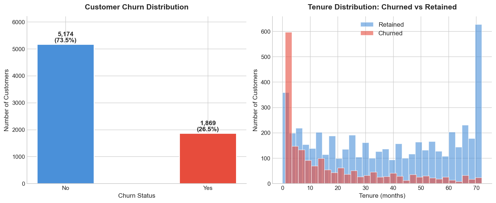
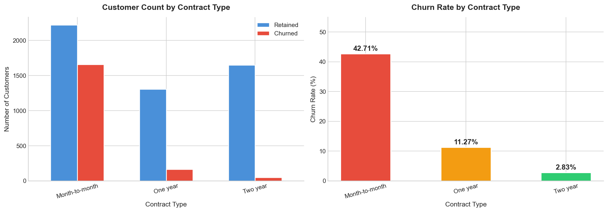
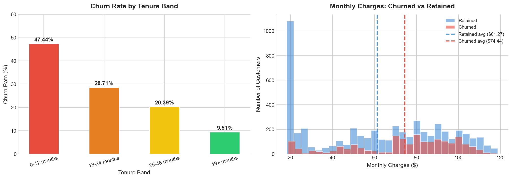
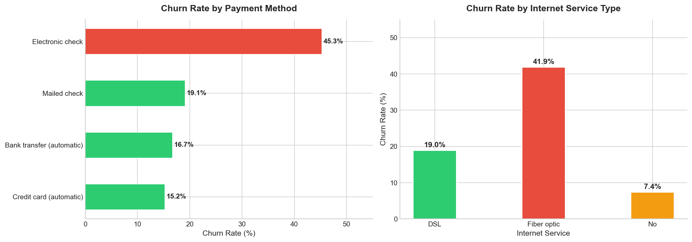
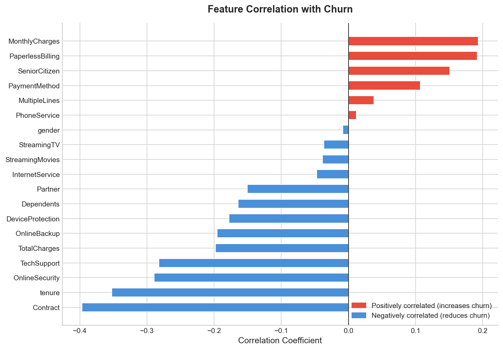
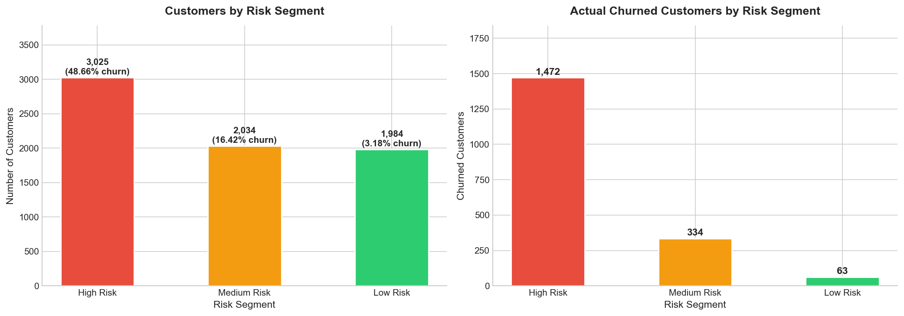
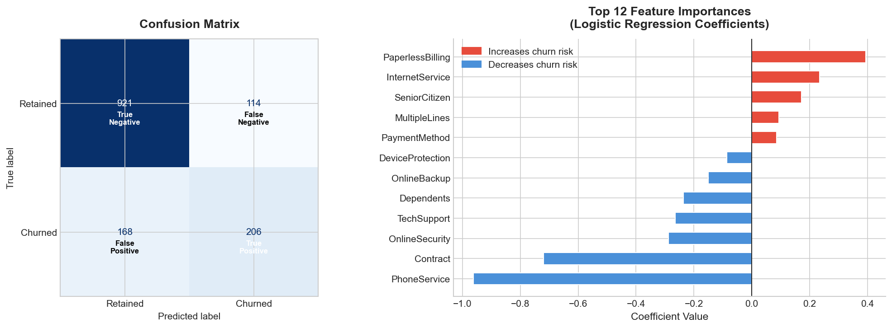

# Customer Churn Analysis
## Which customers are at risk of leaving, and why?

---

## Business Problem

A telecom company is losing 26.54% of its customers annually. The business needs to understand:
1. **Why** customers are churning
2. **Who** is most at risk right now
3. **What** actions the retention team should take first

This analysis answers all three questions using SQL, Python EDA, customer segmentation, and a predictive model.

---

## Dataset

| Property | Value |
|----------|-------|
| Source | IBM Telco Customer Churn (Kaggle) |
| Rows | 7,043 customers |
| Features | 21 (demographics, services, billing, contract) |
| Target | Churn: Yes / No |
| Churn rate | 26.54% — 1,869 customers |

---

## Project Structure

~~~
Customer-Churn-Analysis/
├── Data/
│   └── telco_churn.csv
├── Notebooks/
│   └── churn_analysis.ipynb
├── SQL/
│   └── churn_queries.sql
├── Visuals/
│   ├── 01_Churn_Distribution.png
│   ├── 02_Churn_By_Contract.png
│   ├── 03_Tenure_And_Charges.png
│   ├── 04_Payment_And_Internet.png
│   ├── 05_Correlation_With_Churn.png
│   ├── 06_Risk_Segments.png
│   └── 07_Model_Results.png
└── README.md
~~~

---

## Methodology

### 1. SQL Analysis Layer
Loaded data into SQLite and ran 5 business-focused queries to slice KPIs before any Python work churn by contract type, tenure band, payment method, and average charges.

### 2. Exploratory Data Analysis
7 visualizations answering specific business questions: churn distribution, contract type breakdown, tenure patterns, monthly charges comparison, payment method impact, internet service type, and feature correlations.

### 3. Customer Risk Segmentation
Segmented all 7,043 customers into High / Medium / Low risk tiers using a scoring model based on contract type, tenure, and monthly charges — giving the retention team an immediately actionable list.

### 4. Predictive Model
Trained a logistic regression model on 19 features to predict individual churn probability. Chose logistic regression for interpretability — stakeholders can understand *why* each customer is flagged.

---

## Key Results

### SQL Findings

| Metric | Value |
|--------|-------|
| Overall churn rate | 26.54% |
| Month-to-month contract churn | 42.71% |
| One year contract churn | 11.27% |
| Two year contract churn | 2.83% |
| 0–12 month tenure churn | 47.44% |
| 49+ month tenure churn | 9.51% |
| Electronic check churn | 45.29% |
| Auto payment churn | 15–17% |
| Avg monthly charges — churned | $74.44 |
| Avg monthly charges — retained | $61.27 |

### Segmentation Results

| Segment | Customers | Churn Rate | Avg Tenure |
|---------|-----------|------------|------------|
| High Risk | 3,025 | 48.66% | 11.9 months |
| Medium Risk | 2,034 | 16.42% | 38.5 months |
| Low Risk | 1,984 | 3.18% | 57.4 months |

### Model Performance

| Metric | Value |
|--------|-------|
| Algorithm | Logistic Regression |
| Accuracy | 79.99% |
| Features | 19 |
| Top churn predictor | PaperlessBilling, InternetService (fiber) |
| Top retention predictor | Contract length, PhoneService |

---

## Visualizations

### Churn Distribution & Tenure Pattern

### Churn by Contract Type

### Tenure & Monthly Charges

### Payment Method & Internet Service

### Feature Correlation with Churn

### Customer Risk Segments

### Model Results — Confusion Matrix & Feature Importance

---

## Business Recommendations

### Decision: Focus retention budget on 3 high-impact actions

**Recommendation 1 — Contract upgrade campaign**
Month-to-month customers churn at 42.71% vs 2.83% on 2-year contracts a 15x difference.
Offer a 20% discount to month-to-month customers with 6–12 months tenure to upgrade to a 1-year contract.
Potential impact: Converting 10% of at-risk month-to-month customers retains 147 customers ($130K annual revenue).

**Recommendation 2 — 90-day onboarding program**
47.44% of customers churn in their first year. Trigger proactive outreach at Day 30, Day 60, and Day 90 for all new customers especially fiber optic subscribers (41.9% churn).

**Recommendation 3 — Auto-pay conversion incentive**
Electronic check users churn at 45.29% vs 15–17% for auto-pay users.
Offer a $5/month bill credit to customers who switch to automatic payment.
Auto-pay creates structural stickiness — this one change targets the highest-risk payment segment directly.

### Highest Priority At-Risk Profile
Month-to-month contract + tenure ≤ 14 months + monthly charges > $83 + electronic check = **78–84% predicted churn probability**. Contact these customers first.

---

## Tools Used

| Tool | Purpose |
|------|---------|
| Python / pandas | Data loading, cleaning, feature engineering |
| SQLite | SQL-based KPI analysis layer |
| scikit-learn | Logistic regression, train/test split, evaluation |
| matplotlib / seaborn | All 7 visualizations |
| Jupyter Notebook | Analysis environment |
| GitHub | Version control and portfolio hosting |

---

*Analysis by Parshwa Gandhi | MS Computer Science*
